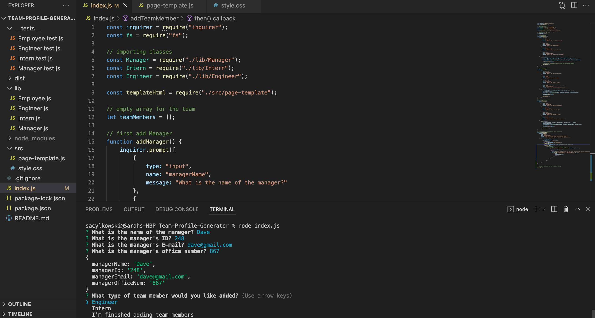

# Team-Profile-Generator

  ## Description
  This is a command line program that makes a team directory.  It will ask the role of each teammate, along with their name, id, and email.  Depending on their role, further information will be asked.  Once all the team memebers information has been added, they will display on a newly created site.

  ## Installation
  To install required dependecies, run the following command:
  npm install

  ## Usage
  This app is simple to use.  You fill out the prompts appropriately and the directory is made.
  

 <a href="https://drive.google.com/file/d/1mnIr4vxsyMJhQuSlWARw5TUaXLJjeFps/view">Click here to see demo video.</a>

  ## Questions
  If you have any questions, please reach out on <a href="https://github.com/sacylkowski/">GitHub</a> or you can <a href="mailto:sacylkowski@gmail.com">E-mail me</a>.
